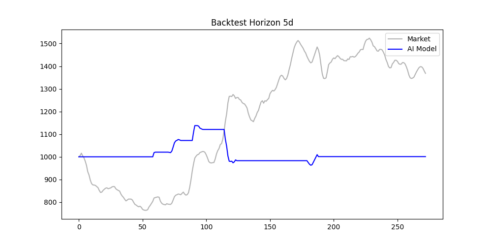
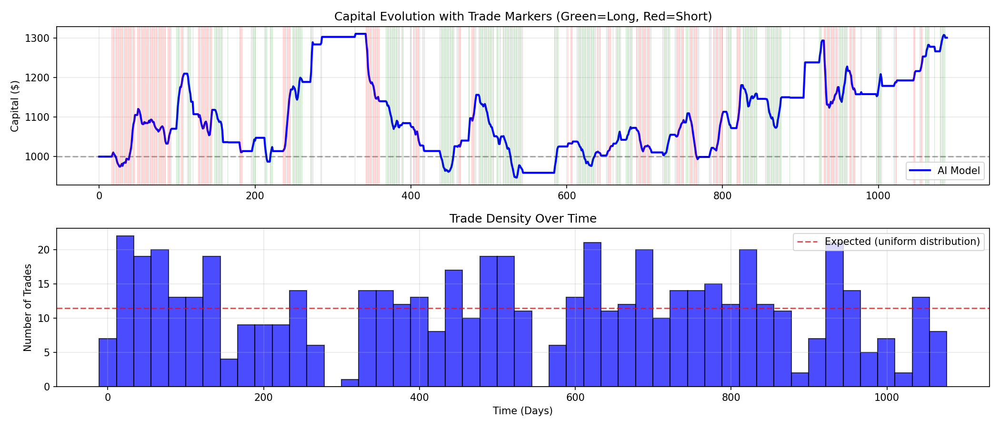

# Forex Direction Forecasting with Deep Learning

Multi-horizon EUR/USD direction classifier built with a **stacked Bidirectional LSTM** (TensorFlow/Keras), trained on 25 years of daily data with 40+ engineered features, and evaluated with a confidence-filtered backtest and walk-forward validation.



## Highlights

- **Multi-horizon targets** — predicts the direction of the close at 1-day and 5-day horizons simultaneously (multi-output sigmoid head)
- **40+ engineered features** — returns & lags, rolling statistics, SMA/EMA crossovers, RSI, Stochastic, MACD, Bollinger Bands, ATR, ADX, momentum/ROC, plus **macro features** (Fed–ECB rate differential via FRED, VIX, DXY)
- **Leak-free evaluation** — strict temporal train/val/test split, scaler fitted on train only, class balancing on train only
- **Confidence-threshold trading** — trades are only taken when the predicted probability clears an optimized threshold, with the threshold tuned on the validation set
- **Walk-forward validation** — rolling retrain/test windows to measure robustness across market regimes
- **Trade timing analysis** — post-hoc study of when the strategy wins and loses



## Architecture

```
Input (60 timesteps × ~45 features)
 → Bidirectional LSTM (64, L2) → BatchNorm → Dropout 0.4
 → Bidirectional LSTM (32, L2) → BatchNorm → Dropout 0.4
 → Dense 32 (ReLU, L2) → Dropout
 → Dense 16 (ReLU, L2) → Dropout
 → Dense n_horizons (sigmoid)
```

Training uses Adam with gradient clipping, class weights, early stopping on validation loss and ReduceLROnPlateau.

## Project structure

| File | Role |
|------|------|
| `main.py` | End-to-end pipeline: data → features → training → evaluation → backtest |
| `data.py` | Data download (yfinance, FRED), feature engineering, sequencing, temporal split, balancing, normalization |
| `model.py` | Bidirectional stacked LSTM architecture, compilation, callbacks, training |
| `analysis.py` | EDA, logistic-regression baseline, threshold optimization, evaluation, backtest |
| `walk_forward_validation.py` | Rolling walk-forward retraining and evaluation |
| `hyperparameter_tuning.py` | Grid comparison of architectures / learning rates |
| `trade_timing_analysis.py` | Win/loss timing breakdown of the strategy |

## Getting started

```bash
pip install -r requirements.txt
python main.py
```

Data is downloaded automatically (EUR/USD, VIX, DXY from Yahoo Finance; interest rates from FRED) — no API key required.

## Disclaimer

Educational project (ESILV — Machine Learning). Not financial advice; past backtest performance does not guarantee future results.
